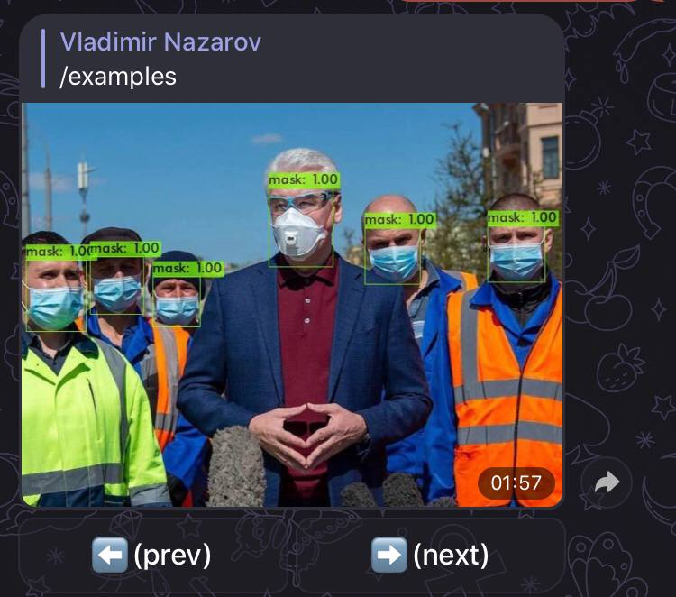
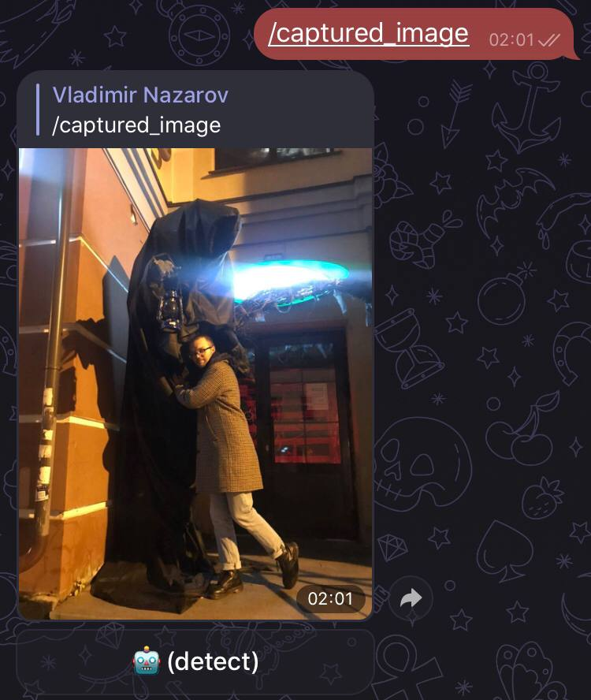

# [@fmask-detector-bot](https://t.me/fmask_detector_bot)

This bot is a demo stand for [MADE2020]("https://data.mail.ru) home assignment. It detects if people on photo wear face masks or not. Detection is based on a usage of state-of-art deep neural network [YOLOv4](https://github.com/AlexeyAB/darknet), originally proposed for [Microsoft COCO dataset](https://cocodataset.org). This implementation uses weights obtained by transfer learning on [face-mask dataset](https://github.com/adityap27/face-mask-detector).

Commands details in /help.

## Usage
### Look through a carousel of usage examples /examples, press arrow bottons to scroll
> 
###
> 
###
> 

### Send your own image to try mask detection, for this uses 🤖(detect) botton in /captured_image
> 
###
> 

Happy usage!
